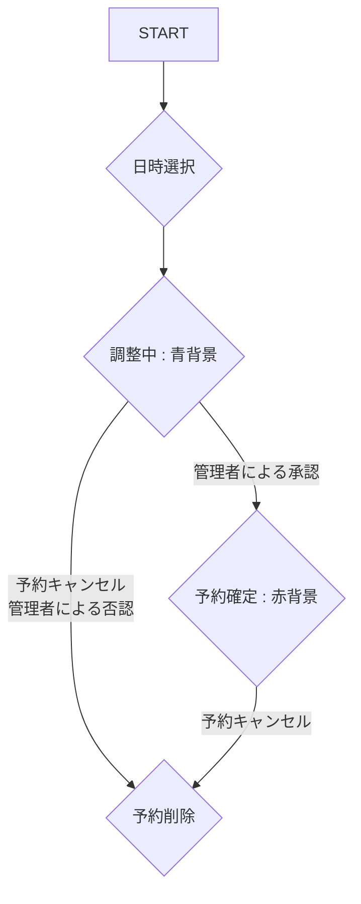
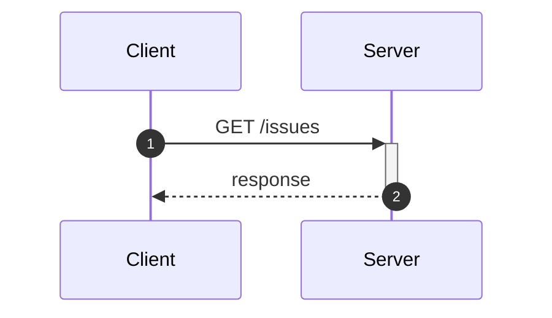

# 飲み会のメモアプリ
##  目的
* 飲み会に適した居酒屋の場所を知りたい
* 情報を集めたい

## 要件
* 食べログのローカル版みたいなやつでも作るかぁ

### 機能
* スプレッドシートにお店を記録し、マップに反映する機能
    * リクルートAPIの情報とユーザーのコメントを保存
    * 店の電話番号で登録したら一意になるかもね
* 検索機能
    * スプレッドシートを走査して合えば
* 削除機能
    * スプレッドシートからデータを削除
    * 店ごと消すと他の人のコメントも消えるのでどうしようね
* 評価をダイアログ表示にするか？(詳細ボタンを押したらダイアログ?)
* https://developer.mozilla.org/ja/docs/Web/HTML/Element/dialog

## イメージ図
* 工事中

## フローチャート

## シーケンス図

## 
